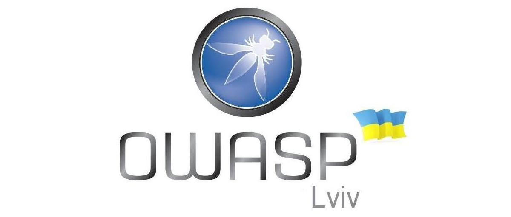

---

layout: col-sidebar
title: OWASP Lviv
tags: supporters-tag past2020-tag past2019-tag past2018-tag past2017-tag
level: 0

region: Europe

---

## Who are we

Welcome to the OWASP Lviv chapter homepage.

The chapter leaders are [Igor Beliaiev](mailto:igor.beliaiev@owasp.org), [Bohdan Serednytskyi](mailto:bohdan.serednytskyi@owasp.org) and [Stanislav Breslavskiy](mailto:stanislav.breslavskiy@owasp.org). The chapter is run by a team of dedicated cybersecurity enthusiasts: [Pavlo Zhavoronkov](https://www.facebook.com/melnuck.p) and [Oksana Safronova](https://www.facebook.com/oksana.safronova.7121).

The chapter aims at holding quarterly meetups in the format of 2
practical workshops and up to 5 talks. The meetups are normally streamed
online and recorded, and are followed by unofficial parties in Lviv
pubs. Everyone are welcome to join us at our chapter meetings.

## How to find us

Follow our news and announcements on social media:
[Facebook](https://www.facebook.com/owasplviv) &
[Telegram](https://t.me/OWASP_UA)

Find us on the semi-official OWASP
[Slack](https://owasp.slack.com/messages/chapter-ua/) channel (you have
to
[register](https://owasp.slack.com/join/shared_invite/enQtNDI5MzgxMDQ2MTAwLTEyNzIzYWQ2NDZiMGIwNmJhYzYxZDJiNTM0ZmZiZmJlY2EwZmMwYjAyNmJjNzQxNzMyMWY4OTk3ZTQ0MzFhMDY)
first)

Watch recordings of our previous events
[YouTube](https://www.youtube.com/channel/UC5CA1njAVqmFv8wmQpQ2jzw)

Join our [Meetup Page](https://www.meetup.com/owasp-lviv-meetup-group/)
 
 
## How to support the chapter

If your company wishes to support the chapter, please contact [Igor Beliaiev](mailto:igor.beliaiev@owasp.org).

# Future Events

## Become a Speaker

Call For Speakers at OWASP Kyiv events is permanently open. If you want
to present at future events, review and agree with the [OWASP Speaker
Agreement](Speaker_Agreement "wikilink") and check for upcoming events
at <https://cfp.owaspukraine.org>, or simply send the title and abstract
of your talk and speaker bio to [Igor Beliaiev](mailto:igor.beliaiev@owasp.org) or [Bohdan Serednytskyi](mailto:bohdan.serednytskyi@owasp.org).

## Become a Sponsor

To sponsor an OWASP Kyiv event, contact [Igor Beliaiev](mailto:igor.beliaiev@owasp.org) or [Stanislav Breslavskiy](mailto:stanislav.breslavskiy@owasp.org).

We don't have any special sponsorship package, however the sponsoring
organization or individual will receive our warm thanks and a fair
amount of gratitude spread over our social media presence, placed at the
chapter official web-page, and announced at the event itself.

## Become a Host

To host an OWASP Kyiv event, contact [Igor Beliaiev](mailto:igor.beliaiev@owasp.org).

Venue requirements include:

  - Capacity to welcome up to 100 attendees
  - Possibility to host a lunch (paid separately by the Chapter)
  - Separate high-quality internet connection for online streaming
  - No need for additional attendee registration or providing attendee
    lists
  - No marketing, advertising, or hiring at the event

## Announcements
>
