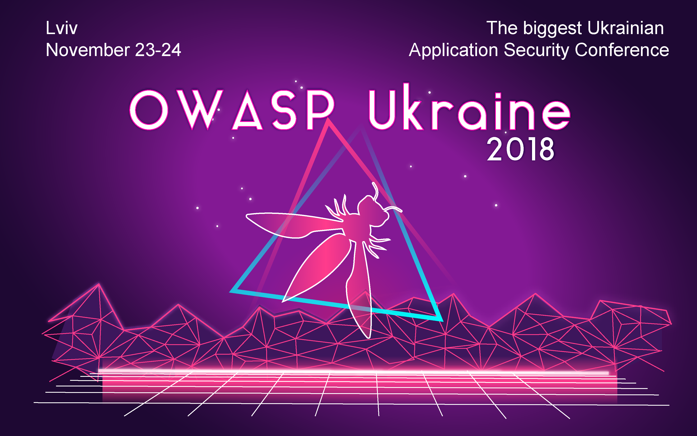

## #1 OWASP Lviv Summer Meetup 2018

**Date** July 28, 2018

#### Program
1. Stanislav Kolenkin - Practical Kubernetes Security.
2. Igor Khoroshenk - AWS security fuckups. How Ops and Security misconfigurations can expose your company valuable assets.
3. Oksana Safronova - Windows persistence - something old, something new, something weird. How to exploit some of the techniques and stay on the system for long enough.
4. Pavlo Zhavoronkov - Extending that monster: Cuckoo functionality for Mac-based Malware analysis.

[Event details](https://www.eventbrite.com/e/owasp-lviv-summer-meetup-tickets-48273016893)

## #2 OWASP Lviv Autumn Meetup 2018

**Date** October 1, 2018

#### Program
1. Yuriy Rudyy - Person of Interest (locate and identify device: cell LAC, WiFi, iBeacon...)
2. Igor Khoroshchenko - Data Leakages Epic Fuckups
3. Vasyl Verbovyi - Sometimes, shit comes. A couple of words about routers firmware

[Event details](https://www.eventbrite.com/e/owasp-lviv-autumn-meetup-tickets-50637578360)

## #3

**Date** November 23-24, 2018

#### Program

[Event
schedule](https://2018.owaspukraine.org/)

**Day 1 (Workshops):**
Stream1:

1. IGOR KHOROSHCHENKO - AWS Security FUCKUPS
2. BOGDAN LUKIN - WAF Evasion Techniques
3. DANIAL ZHURAVCHAK - Analyze or Die - SOC game

Stream 2:
1. IGOR BLUMENTAL - Content Security Policy tips and tricks
2. SERHII KOROLENKO - CSRF exploitation
3. Andrey Voloshin - Reverse Engineering Hardware & Firmware

**Day 2:**
1. Eduard Babych - Intro to Bug Bounty. How to become a Bug Bounty Hunter
2. Lukasz Korczyk - CSRF - why your organization shouldn't set it to low?
3. Vitaliy Mechytashvili - Safari extensions. Suspicious javascript functions. Mojave security improvements bypass
4. Vlada Kulish - Wanna test IOS applications? Let the pain in
5. Kostiantyn Korsun - New National Cybersecurity System: Concept
6. Rener Alberto F. Silva - SPLITTER: An Approach to Difficult Correlation, Traffic Analysis and Statistical Attacks Inside TOR Network
7. Yurii Bilyk - So, you want hack some device?
8. Oleh Levytskyi - Security issues with Chrome extensions on a practical use-cases
9. Pavlo Radchuk - Blockchain is secure (not)
10. Oleksandr Yakovliev, Olesia Myshkovska - Fuzzing and searching for vulnerabilities in third-party Android services embedded by manufacturers
11. Hacking QUIZ and Hacker party
