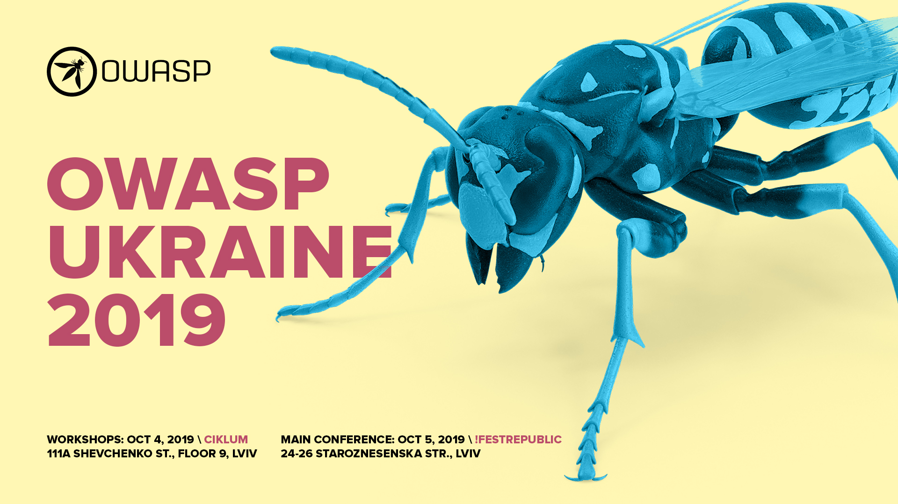

## #1 OWASP Lviv Winter Meetup 2019

**Date** February 19, 2020 

#### Program
1. Vadym Opryshko - Security assessment: prepare yourself, not policies.
2. Ben Whaley - The best and worst AWS security practices
3. Vasyl Verbovyi - Sometimes, shit comes. A couple of words about routers firmware)

[Event details](https://www.eventbrite.com/e/owasp-lviv-winter-meetup-tickets-56666996512)

## #2 OWASP Lviv Winter Meetup 2019

**Date** August 28, 2019 

#### Program
1. Eduard Kiiko - Variety of Linux logging tools and their integrations
2. Pavlo Zhavoronkov - Darknet security best practices
3. Danial Zhuravchak - SRE: Monitoring

[Event details](https://www.eventbrite.com/e/owasp-lviv-summer-meetup-2019-tickets-70361002653)

## #3

**Date** October 04-05, 2019

#### Program

[Event
schedule](https://owaspukraine.org/)

**Day 1 (Workshops):**
Stream1:

1. Кирило Гобреняк - From Zero to Hero in Web Application Security Testing with OWASP.
2. Ігор Блюменталь - GraphQL Security Testing
3. Володимир Стиран - Tactical Offensive Reporting

Stream 2:
1. Віталій Сусукайло та Олексій Сведенюк - Power of Azure Log Analytics
2. Едуард Кійко та Данило Журавчак - Boss of The SOC
3. Vladimir Taratushka - Pentest + Social Engineering = Always win

**Day 2:**
1. Kostiantyn Korsun - #FRDv2.0: new adventures
2. Ewerson Guimaraes - Some Burp Kung-Fu
3. Ali Huseyn Aliyev - Bluetooth Low Energy (BLE) under the microscope, attack techniques
4. Eduard Kiiko and Danial Zhuravchak - Threat Hunting: DNS security
5. Ricardo Fajin - Using Frida in Mobile Pentest Android
6. Oksana Safronova - Normal activity detected
7. Serhii Korolenko - Web vulnerabilities. In and out half an hour.
8. Bohdan Lukin - Attacking Active Directory in examples
9. Andrii Kudyurov - Doing OWASP ASVS audit for released products: pros, cons and a slight pain
10. Nadia Klymenko - Approaches to keep your privacy
11. CTF and Hacker party

[Video recordings](https://www.youtube.com/channel/UC5CA1njAVqmFv8wmQpQ2jzw/videos)

## #4 OWASP Lviv Winter Meetup 2019

**Date** December 19, 2019 

#### Program
1. Overview of DevSecOps
2. Auditing Docker containers
3. Infrastructure code security testingg

[Event details](https://www.eventbrite.com/e/devsecops-meetup-tickets-86522181173)
