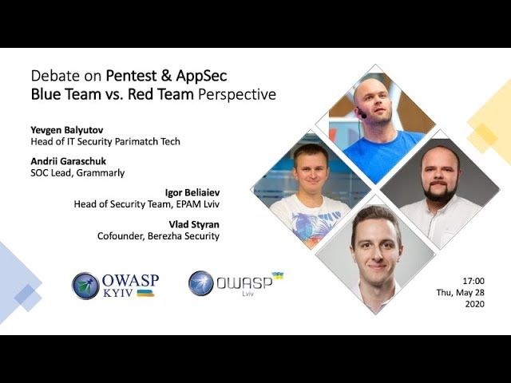
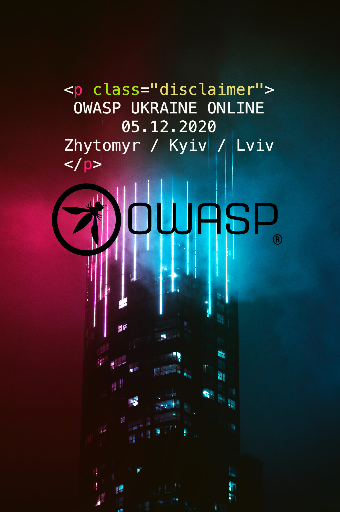

### #1 Chapter Webinars 2020

[Video recording](https://www.youtube.com/watch?v=_AI2fd6C9j4)

### #2 OWASP Ukraine 2020

**Date** Deember 5th, 2020 

#### Program

[Event
schedule](https://cfp.owaspukraine.org/owaspukraine2020/schedule/)

1.  “React Native Security: Addressing Typical Mistakes” by Julia Potapenko |
    [Video](https://www.youtube.com/watch?v=SdnSHb2zFW0&list=PLBvwykOxvhNa3J67VHtmJsxT_c2LPyUNz&index=1)
2.  “Безпека додатку Дія - “Оскар” чи “Золота малина”” by Константин Корсун |
    [Video](https://www.youtube.com/watch?v=_Gn3zFPpuV8&list=PLBvwykOxvhNa3J67VHtmJsxT_c2LPyUNz&index=2)
3.  “OAuth2.0: What? Where? When?” by Anatolii Bereziuk |
    [Video](https://www.youtube.com/watch?v=kuBx8u-lAkk&list=PLBvwykOxvhNa3J67VHtmJsxT_c2LPyUNz&index=3)
4.  “OWASP JuicyShop Workshop” (Workshop) by Serhii Korolenko & Eduard Kiiko & Oksana Safronova |
    [Video](https://www.youtube.com/watch?v=fJDgXOLpmnw&list=PLBvwykOxvhNa3J67VHtmJsxT_c2LPyUNz&index=4)
5.  “Leveraging the crowd power to regain faith in Internet’s zero trust architecture” by Philippe Humeau |
    [Video](https://www.youtube.com/watch?v=R6uwwzWZJMk&list=PLBvwykOxvhNa3J67VHtmJsxT_c2LPyUNz&index=5)
6.  “Serverless security: attack & defense” by Pawel Rzepa |
    [Video](https://www.youtube.com/watch?v=iy4iw8VgyHM&list=PLBvwykOxvhNa3J67VHtmJsxT_c2LPyUNz&index=6)
7.  “6 digit OTP for 2FA is brute-forceable in 3 days + OTP Lottery” by Maksym Khramov & Serhii Korolenko |
    [Video](https://www.youtube.com/watch?v=7YlqYWEweqk&list=PLBvwykOxvhNa3J67VHtmJsxT_c2LPyUNz&index=7)
